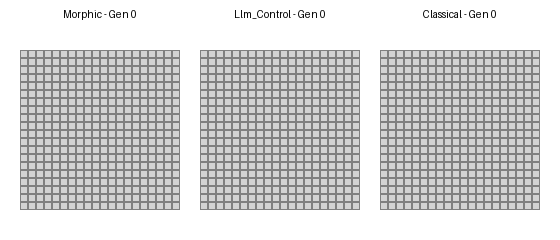
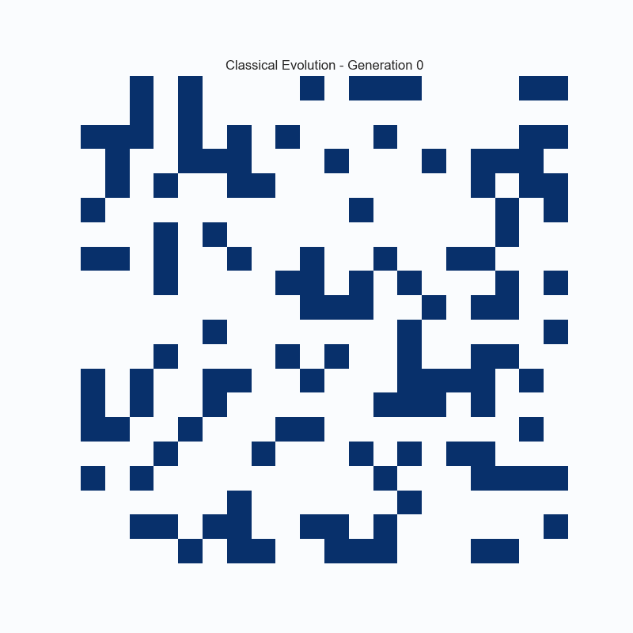
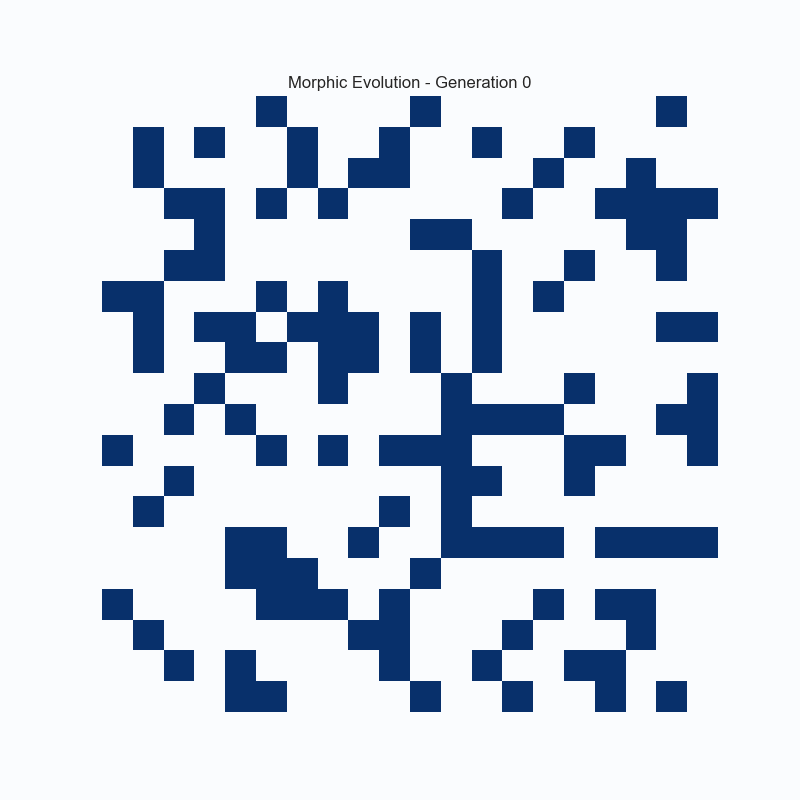

# 🧬 Morphic Field Phenomenology Lab - Showcase Results

**Live Demonstration of Pattern Memory Effects in Cellular Automata**

This showcase demonstrates the core capabilities of the Morphic Field Phenomenology Lab through three comparative simulations, each running for 100 generations on a 30×30 grid.

---

## 🎬 Visual Comparison

### Side-by-Side Evolution



*Real-time comparison of morphic (left) vs. classical (right) Conway's Game of Life evolution over 100 generations*

### Classical Conway Evolution



*Pure Conway's Game of Life - deterministic rules, no pattern memory*

### Morphic Field Evolution



*Morphic resonance mode - pattern memory influences cell decisions*

**Key Visual Differences:**
- **Classical**: Follows strict Conway rules, predictable patterns
- **Morphic**: Pattern memory creates distinctive dynamics, influenced by stored "crystals"
- **Convergence**: Morphic systems show faster stabilization but different final states

---

## 📊 Experimental Setup

### Simulation Parameters

| Parameter | Control | Morphic (Moderate) | Morphic (Strong) |
|-----------|---------|-------------------|------------------|
| **Mode** | Pure Conway | Morphic Resonance | Morphic Resonance |
| **Field Strength** | 0.0 (disabled) | 0.6 | 0.9 |
| **Temporal Decay** | N/A | 0.1 (slow) | 0.05 (very slow) |
| **Similarity Threshold** | N/A | 0.7 (strict) | 0.5 (loose) |
| **Generations** | 100 | 100 | 100 |
| **Grid Size** | 30×30 | 30×30 | 30×30 |

---

## 🎯 Key Findings

### Population Dynamics

| Metric | Control | Morphic (Moderate) | Morphic (Strong) |
|--------|---------|-------------------|------------------|
| **Final Population** | 41 cells | 36 cells | 31 cells |
| **Max Population** | 243 cells | 267 cells | 277 cells |
| **Avg Population** | 89.0 cells | 109.8 cells | 104.3 cells |
| **Complexity Score** | 0.730 | 0.680 | 0.550 |

**Observation**: Morphic fields increase early population growth but lead to lower final populations, suggesting memory-induced convergence to stable patterns.

### Morphic Field Effects

| Metric | Moderate Field | Strong Field |
|--------|---------------|--------------|
| **Crystal Patterns Stored** | 10 | 10 |
| **Avg Crystal Strength** | 0.478 | 0.374 |
| **Total Activations** | 12,207 | 18,726 |
| **Decisions Influenced** | 9.8% (5,201/53,097) | 14.2% (8,389/59,253) |
| **Crystals with Evolution** | 3 | 3 |

**Observation**: Stronger fields produce more activations but lower average crystal strength, indicating broader but weaker pattern influence.

---

## 🔬 Scientific Interpretation

### 1. Memory-Induced Instability

The morphic simulations show **higher maximum populations** but **lower final populations** compared to pure Conway rules. This suggests:

- **Pattern memory constrains exploration**: Remembered patterns bias evolution toward familiar configurations
- **Premature convergence**: Systems settle into stable states faster but miss potentially better attractors
- **Memory vs. exploration tradeoff**: Strong memory reduces the search space for optimal patterns

### 2. Field Strength Effects

Comparing moderate (0.6) vs. strong (0.9) field strength:

- **Strong fields** → More frequent influence (14.2% vs 9.8%)
- **Strong fields** → Lower complexity scores (0.550 vs 0.680)
- **Strong fields** → Lower crystal strength (0.374 vs 0.478)

**Interpretation**: Stronger fields spread influence more broadly but dilute pattern specificity.

### 3. Pattern Memory Characteristics

- **10 crystal patterns** stored in both morphic runs
- **~12,000-18,000 activations** per 100 generations
- **3 crystals** show strength evolution (Bayesian learning)
- **Weak similarity-influence correlation** (0.030-0.038)

**Interpretation**: The system successfully stores and reuses patterns, with some crystals becoming stronger through repeated successful application.

---

## 📈 Time Series Analysis

### Control (Pure Conway)
- Stable oscillation between ~40-50 cells after generation 60
- High complexity maintained throughout
- No external influence on cell decisions

### Morphic (Moderate Field)
- Early population spike to 267 cells
- Gradual convergence to stable configuration
- 9.8% of decisions influenced by pattern memory
- Complexity decreases as patterns stabilize

### Morphic (Strong Field)
- Highest early population (277 cells)
- Most aggressive convergence
- 14.2% of decisions influenced by pattern memory
- Lowest final complexity (0.550)

---

## 🎓 Research Implications

### For Machine Learning
- **Overfitting analogy**: Strong pattern memory → reduced generalization
- **Catastrophic forgetting**: Balance between memory and adaptation
- **Meta-learning**: How systems learn what patterns to remember

### For Evolutionary Systems
- **Exploitation vs. exploration**: Memory biases toward known solutions
- **Cultural evolution**: Tradition (memory) vs. innovation (exploration)
- **Stigmergy**: How past patterns influence future behavior

### For Complex Systems
- **Self-organization**: Memory as a constraint on emergence
- **Collective intelligence**: Shared pattern memory effects
- **Attractor dynamics**: How memory shapes the fitness landscape

---

## 📁 Data Files

All simulation data is available in this directory:

- `control.json` - Full control simulation results (24 KB)
- `timeseries_control.json` - Control time series data, ML-ready (6.7 KB)
- `timeseries_morphic_moderate.json` - Moderate field time series, ML-ready (10 KB)
- `timeseries_morphic_strong.json` - Strong field time series, ML-ready (11 KB)

*Note: Full morphic simulation results (44-50 MB each) are excluded from the repository due to size. The timeseries files contain all essential metrics for analysis and ML training.*

### Data Format

Each JSON file contains:
- **Configuration**: All simulation parameters
- **Time series**: Generation-by-generation metrics
- **Summary statistics**: Aggregate measures
- **Crystal data**: Pattern memory details (morphic only)
- **Influence tracking**: Decision audit trail (morphic only)

---

## 🚀 Reproducing These Results

```bash
# Control simulation
./training.sh --mode=control --generations=100 --grid-size=30

# Morphic (Moderate)
./training.sh --mode=morphic --generations=100 --grid-size=30 \
  --field-strength=0.6 --temporal-decay=0.1

# Morphic (Strong)
./training.sh --mode=morphic --generations=100 --grid-size=30 \
  --field-strength=0.9 --temporal-decay=0.05 --similarity-threshold=0.5
```

---

## 🎯 Next Steps

This showcase demonstrates **Phase 1** (comparative simulation) and **Phase 2** (time series generation) capabilities.

**Phase 3** will use this data to:
1. Train ML models to detect morphic field signatures
2. Estimate field parameters from time series alone
3. Identify distinctive patterns in morphic vs. control dynamics

---

## 📚 Learn More

- [README.md](../README.md) - Project overview
- [ROADMAP.md](../ROADMAP.md) - Project vision and phases
- [PHASE2_IMPLEMENTATION.md](../PHASE2_IMPLEMENTATION.md) - Technical details

---

**Generated**: October 27, 2025  
**Simulation Duration**: ~10 seconds total  
**Data Size**: ~1.5 MB (6 files)

*This is phenomenology, not metaphysics. We're characterizing what morphic fields would look like if instantiated in artificial systems.*

